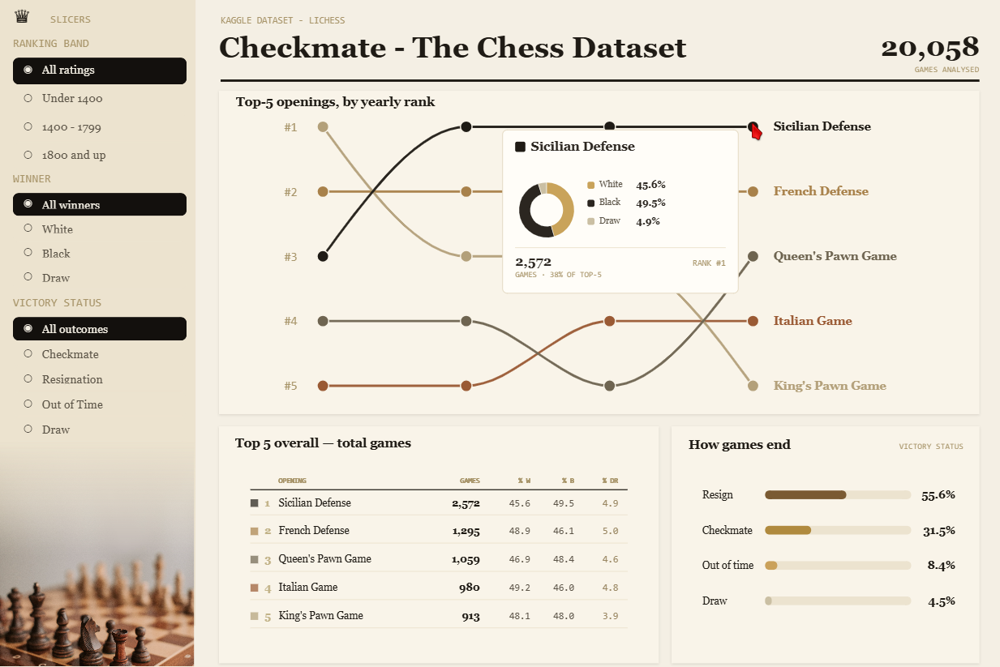

# Checkmate — The Chess Dataset

An editorial-style **Power BI** report exploring **20,058 Lichess games**: which openings rise and fall in popularity over time, how often each side wins, and how games actually end.

Built entirely **as code** in the [PBIP](https://learn.microsoft.com/power-bi/developer/projects/projects-overview) format — semantic model in TMDL, report in PBIR, and the signature visuals authored in **Deneb (Vega)** rather than off-the-shelf charts.

Hovering an opening reveals an in-chart card — outcome donut, total games, share of the top-5, and overall rank.

---

## Highlights

- **Opening bump chart (custom Deneb / Vega).** A rank-by-year "bump" of the top-5 opening families, rebuilt from scratch in Vega so the tooltip could live *inside* the chart.
- **In-chart hover card.** Hovering any line (anywhere along it — the card follows the cursor) reveals a designed card: an outcome **donut** (White / Black / Draw), total games, overall rank, and the opening's **share of the top-5**. Outcome percentages are games-weighted across years, not a single year's snapshot.
- **Native Button-slicer rail.** Ranking band, winner, and victory status as styled Power BI button slicers — dark selected pills, muted unselected items, single-select with an "All" default driven by calculation groups.
- **Editorial design system.** A warm cream/ink palette, Playfair/Spectral/JetBrains-Mono-inspired typography, and a consistent card language across the page.

## How it's built

| Layer | Tech |
|---|---|
| Semantic model | **TMDL** — star schema (FactGames + DimOpening / DimOutcome / DimDate / …), calculation-group slicers, and DAX measures (opening rank by year, weighted outcome %, share of top-5, rank-movement) |
| Report | **PBIR** — pages, visuals, bookmarks, theme |
| Signature visuals | **Deneb (Vega / Vega-Lite)** — the bump chart + integrated hover card |
| Authoring | `pbir` CLI + the Power BI Desktop bridge (edit → reload → screenshot loop) |

## The data

The [Lichess "Chess Game Dataset"](https://www.kaggle.com/datasets/datasnaek/chess) (Kaggle): ~20k rated and casual games with openings (ECO), ratings, winner, victory status, and move counts. The model derives opening families, rating bands, and yearly opening ranks from the raw `games.csv`.

## Open it yourself

1. Clone the repo.
2. Open `Chess Outcomes Lichess.pbip` in **Power BI Desktop**.
3. Load `games.csv` when prompted.

> Deneb (the custom-visual host) must be installed to render the bump chart and its tooltip.

---

*Power BI report design and build — InsightfulAnalytics. Visual design developed with Claude.*
